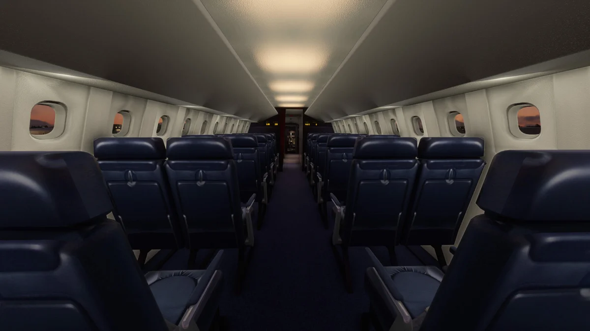

O Concorde não é apenas um avião. É um símbolo de uma era em que a aviação ousou desafiar os limites do possível — um pássaro branco e elegante que cruzava o Atlântico a mais de duas vezes a velocidade do som, transportando passageiros entre Londres e Nova Iorque em pouco mais de três horas. Desde a sua retirada de serviço em 2003, o fascínio pelo Concorde nunca desvaneceu. E agora, graças à DC Designs, esta lenda supersónica está prestes a renascer no Microsoft Flight Simulator 2024 com uma reconstrução nativa de raiz.

## De MSFS 2020 a MSFS 2024: uma reconstrução completa

A DC Designs não é desconhecida no universo dos addons de simulação de voo. O seu Concorde original para o MSFS 2020, lançado em março de 2022, rapidamente se tornou um dos addons mais populares da plataforma. Contudo, a transição para o MSFS 2024 não se limitou a uma simples conversão de compatibilidade. A equipa optou por reconstruir o addon nativamente para a nova plataforma, tirando partido das melhorias no motor gráfico, no sistema de áudio e nas capacidades de simulação de voo do MSFS 2024.

O projeto encontra-se atualmente nas fases finais de desenvolvimento, com o Concorde já a voar ativamente no simulador. Os sistemas centrais foram adaptados à nova arquitetura do MSFS 2024, e os resultados preliminares são, segundo a DC Designs, extremamente promissores.

## Voo a Mach 2 e 60.000 pés: o modelo de voo

O coração de qualquer addon de simulação de voo reside no seu modelo de voo, e a DC Designs dedicou uma atenção meticulosa a este aspeto. O Concorde virtual é capaz de atingir Mach 2 — aproximadamente 2.180 km/h — e operar a altitudes superiores a 60.000 pés, onde a curvatura da Terra se torna visível e o céu adquire uma tonalidade escura quase espacial.

O modelo de voo procura reproduzir fielmente as características únicas do Concorde real: a transição para o regime supersónico, os efeitos do aquecimento aerodinâmico, a gestão do centro de gravidade através da transferência de combustível e a peculiar atitude de nariz elevado durante a aproximação, facilitada pelo icónico nariz basculante.

*Crédito: [DC Designs](https://dcdesigns.uk/concorde/)*

## Um cockpit 3D de cortar a respiração

O cockpit do Concorde é uma obra-prima da engenharia dos anos 60 e 70 — uma parede de instrumentos analógicos, interruptores e painéis que exigiam uma tripulação de três pessoas: piloto, copiloto e engenheiro de voo. A DC Designs reproduziu este ambiente com um cockpit 3D completo e totalmente interativo.

Cada interruptor, cada manípulo, cada indicador foi modelado e animado. O painel do engenheiro de voo, posicionado entre os dois pilotos e estendendo-se para a retaguarda, é particularmente impressionante. É aqui que se gere um dos sistemas mais complexos alguma vez simulados num addon para MSFS: o sistema de combustível.

## 138 linhas de combustível, 64 bombas e 38 válvulas

Se existe uma característica que define a complexidade operacional do Concorde, é o seu sistema de combustível. No avião real, o combustível não servia apenas para alimentar os quatro motores Rolls-Royce/SNECMA Olympus 593 — era também utilizado para controlar o centro de gravidade da aeronave durante a transição entre o voo subsónico e supersónico, e vice-versa.

A DC Designs implementou este sistema com um nível de detalhe notável: 138 linhas de combustível, 64 bombas e 38 válvulas, todos funcionais e geridos através do painel do engenheiro de voo. Esta não é uma simulação superficial — é uma recriação que exige estudo e dedicação por parte do piloto virtual, tal como o Concorde real exigia dos seus tripulantes.

## Radar meteorológico, FMC e compatibilidade VR

Para além do sistema de combustível, o Concorde da DC Designs inclui um radar meteorológico funcional, permitindo aos pilotos identificar e contornar formações meteorológicas adversas — algo particularmente relevante quando se voa a velocidades supersónicas, onde o tempo de reação é drasticamente reduzido.

O Flight Management Computer (FMC) permite a programação de rotas e a navegação automatizada, enquanto a compatibilidade total com realidade virtual (VR) oferece uma imersão sem precedentes. Sentar-se no cockpit do Concorde em VR, rodeado por centenas de instrumentos, com o rugido dos motores Olympus a preencher o espaço, é uma experiência que os entusiastas de aviação dificilmente esquecerão.

Os efeitos de chuva no para-brisas e os sons nativos do MSFS 2024 completam a experiência sensorial, enquanto os efeitos visuais personalizados — incluindo a onda de choque visível durante a travessia da barreira do som — acrescentam um toque cinematográfico aos voos supersónicos.

*Crédito: [DC Designs](https://dcdesigns.uk/concorde/)*

## Pinturas históricas e cabine de passageiros

O addon incluirá quatro pinturas históricas que representam as diferentes eras do Concorde:

- **British Airways 1985–1987** — a icónica libré Landor com a cauda azul escura
- **British Airways 1997–2003** — a libré Chatham Dockyard utilizada nos últimos anos de serviço
- **Air France 1976–2003** — a elegante pintura branca com detalhes azuis, vermelhos e brancos da companhia francesa
- **Singapore Airlines G-BOAD** — a rara libré mista resultante da parceria entre a British Airways e a Singapore Airlines

Cada pintura foi reproduzida com rigor histórico, baseada em fotografias e documentação de época. Para além do cockpit, a DC Designs modelou igualmente a cabine de passageiros dianteira, permitindo aos utilizadores explorar o interior estreito mas luxuoso onde, durante décadas, viajaram celebridades, políticos e homens de negócios dispostos a pagar um preço premium pela velocidade.

## Tripulação de terra interativa e Career Mode

A integração com o MSFS 2024 vai além da aeronave em si. O addon inclui uma tripulação de terra interativa, visível durante as operações em plataforma, que acrescenta vida e realismo às fases de preparação do voo.

Após o lançamento, a DC Designs planeia adicionar suporte para o Career Mode do MSFS 2024, permitindo aos jogadores operar o Concorde dentro do sistema de progressão de carreira do simulador. Embora os detalhes sobre esta funcionalidade ainda sejam limitados, a perspetiva de construir uma carreira enquanto piloto do Concorde é certamente aliciante.

## Disponibilidade e preço

O DC Designs Concorde para MSFS 2024 será distribuído pela [Just Flight](https://dcdesigns.uk/concorde/) ao preço de 39,99 dólares. Considerando a profundidade dos sistemas simulados, a qualidade visual e a singularidade da aeronave, trata-se de um preço competitivo no mercado de addons de simulação de voo.

Embora a data exata de lançamento ainda não tenha sido oficialmente confirmada, o facto de o addon já se encontrar a voar no MSFS 2024 durante as fases finais de desenvolvimento sugere que o lançamento não deverá estar distante.

## Uma oportunidade única para os apaixonados por aviação

O Concorde ocupa um lugar especial no imaginário coletivo da aviação. Foi o único avião comercial supersónico ocidental a entrar em serviço regular, e a sua silhueta delta permanece instantaneamente reconhecível mais de duas décadas após o último voo. Para muitos entusiastas de simulação de voo, pilotar o Concorde representa o culminar de um sonho — voar mais alto e mais depressa do que qualquer outro avião comercial, numa era em que tal proeza parecia perfeitamente natural.

A reconstrução nativa da DC Designs para o MSFS 2024 promete ser a versão mais completa e imersiva do Concorde alguma vez criada para um simulador de voo doméstico. Com sistemas de profundidade ímpar, visuais de excelência e a integração plena com as funcionalidades do MSFS 2024, este addon poderá muito bem tornar-se uma referência incontornável para a comunidade.

Para acompanhar o desenvolvimento e obter mais informações, consulte a [página oficial do Concorde na DC Designs](https://dcdesigns.uk/concorde/) e o [artigo de atualização na FSNews](https://fsnews.eu/dc-designs-concorde-development-update-for-msfs-2024/).
