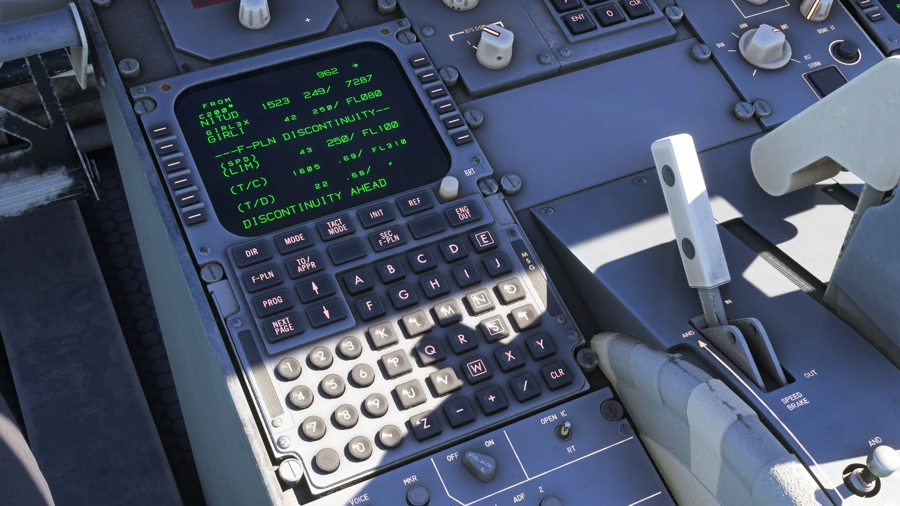

Após mais de dois anos de desenvolvimento interno, a **Just Flight** dá os últimos retoques no seu **Fokker F70/F100 Professional Bundle** para o Microsoft Flight Simulator 2020 e 2024. A atualização de desenvolvimento de maio de 2026 confirma que a lógica do modo Profile do AFCAS foi reescrita, o modelo de travagem afinado e a equipa entrou na fase final de correção de erros antes do lançamento.

## Um Fokker finalmente à altura do simulador moderno

O Fokker F100 foi um avião regional discreto mas omnipresente desde o final dos anos oitenta: transportou milhões de passageiros pela Europa, Ásia e Austrália, e em 1995 ganhou um irmão mais curto, o F70. KLM Cityhopper, Austrian Airlines, Air France Régional, American Airlines, QantasLink e Alliance Airlines operaram frotas consideráveis, e a família continua a voar hoje em companhias como a Alliance Airlines ou a Carpatair. Apesar deste peso real, os Fokker nunca tinham tido uma versão de alta fidelidade no MSFS — o bundle da Just Flight é o primeiro projeto sério a colmatar essa lacuna.

O pacote inclui **cinco subvariantes**: um F70 com escada integral e porta de carga grande, mais quatro configurações de F100 que combinam escada integral ou porta deslizante, porta de carga pequena ou grande, e a opção da porta L2. Ambos os aviões usam turbofans Rolls-Royce Tay — o **Tay 620-15** no F70 e o **Tay 650** no F100, mais pesado. A Just Flight gravou os motores num avião real nos Países Baixos e integrou as gravações num pacote sonoro Wwise que, segundo o estúdio, contém mais de 500 amostras individuais.

## Sistemas codificados de raiz, e não MSFS de série

O que distingue este projeto de um payware MSFS comum é a quantidade de código próprio escrito do zero. O **FMS** é uma implementação à medida com duplo CDU, LNAV/VNAV reais, alinhamento IRS com tempos credíveis, importação de planos de voo e toda a hierarquia de páginas Fokker original (DIR, MODE, TACT MODE, INIT, REF, F-PLN, TO/APPR, PROG). Por cima trabalha um **Automated Flight Control and Augmentation System (AFCAS)** igualmente codificado em casa, que comanda os modos lateral e vertical, incluindo uma descida Profile que respeita as restrições de altitude e velocidade, e um autoland cuidadosamente calibrado.

Por baixo da aviónica, a simulação chega ao íntimo da célula. Cada circuito hidráulico é modelado de forma independente, com bombas elétricas; a rede elétrica separa motor, APU, fonte externa e emergência com gestão dos TRU; pressurização, demanda de ar de bleed, antigelo e a lógica de transferência de combustível comportam-se como no avião real. O célebre **aerofreio de cauda e os lift dumpers**, o bloqueio antirrajadas, os comandos alternativos de estabilizador e flaps, e a cinemática do trem dependente de pressão estão todos reproduzidos individualmente, sem se esconderem por trás de animações genéricas.

*Crédito: [Just Flight](https://www.justflight.com/in-development/f70-f100-professional-bundle)*

## O que muda para o piloto virtual

Para quem já voa um FlyByWire A320, um iniBuilds A310 ou um PMDG 737, o F70/F100 será uma incursão por uma geração anterior de cockpits — instrumentos analógicos de reserva, ecrãs CRT curvos, switches clássicos — mas com a profundidade de sistemas que tornou famosos esses add-ons modernos. Comandante, primeiro oficial e observador estão totalmente modelados, com interruptores e disjuntores animados; a Just Flight acrescentou ainda clickspots ocultos (TOGA, ajuste padrão de altímetro) para manter o uso confortável em voo. Para quem quer ampliar a frota com outras aeronaves de nível estudo, o nosso [guia das melhores aeronaves pagas para a simulação de voo em 2026](/pt/blog/melhores-aeronaves-pagas-simulacao-2026) percorre o panorama atual em MSFS, X-Plane e DCS.

Os Tay têm personalidade própria. Reativos a baixa altitude, sobem com calma quando o F100 vai pesado: o blog de desenvolvimento refere cerca de trinta minutos e 156 milhas náuticas para atingir o FL350 ao peso máximo de descolagem em condições ISA. É exatamente o tipo de restrição que transforma um curto trajeto europeu — Amesterdão-Munique, Lisboa-Faro, Viena-Bucareste — num voo procedimental completo em vez de num exercício de avanço rápido. Com um alcance máximo de cerca de 1 500 milhas náuticas, o bundle aponta às redes regionais onde o Fokker brilhou.

## Cabina, EFB e pequenos detalhes

A cabina de passageiros completa é acessível e interativa. Iluminação, portas, interfones e galleys são operáveis; os anúncios de bordo, o leitor de música digital e a lógica Auto Cabin Crew vêm incluídos; os LODs estão calibrados para que andar pelo avião não destrua os FPS. Cada decoração traz texturas de cabina próprias, e as **30 decorações incluídas** — 11 para o F70 e 19 para o F100, desde KLM Cityhopper e Austrian Airlines até American Airlines, TAM ou Serviço Aéreo do Governo Eslovaco — cobrem praticamente todos os aviões que um piloto virtual quereria voar.

*Crédito: [Just Flight](https://www.justflight.com/in-development/f70-f100-professional-bundle)*

O EFB cobre toda a parte operacional: estados cold-and-dark ou turnaround, gestor de combustível e carga com controlo por tanque, embarque e abastecimento a ritmos realistas, GPU e calços, cálculo de descolagem e aterragem, **importação OFP do SimBrief**, METAR, seguimento cartográfico em tempo real e **cartas Navigraph** através de subscrição separada. A compatibilidade com GSX, o modo walkaround do MSFS 2024 e o sistema nativo de checklists interativas — perto de 300 itens, mais de 250 antes da descolagem — fecham o pacote.

## Como tirar o máximo partido

A melhor forma de entrar no avião é começar com **uma rotação curta na Europa** — KLM Cityhopper Amesterdão-London City, ou Austrian Viena-Frankfurt — com peso moderado, para o avião ter margem de subida até um FL razoável. Quando as páginas do FMS, os modos AFCAS e a lógica do aerofreio e lift dumpers já forem familiares, etapas mais longas pela rede australiana da Alliance Airlines ou QantasLink colocarão à prova o modo Profile e o autoland. A compatibilidade com a checklist interativa do MSFS está confirmada: quem prefere a interface nativa do simulador terá o fluxo completo de quase 300 itens sem precisar de add-ons de terceiros.

A [página do produto em desenvolvimento na Just Flight](https://www.justflight.com/in-development/f70-f100-professional-bundle) é o melhor sítio para acompanhar a próxima atualização — a entrada de maio de 2026 menciona os testes finais em voo e a correção dos últimos bugs, o que costuma anunciar uma janela de lançamento medida em semanas.

## Conclusão

Se o projeto cumprir o que os blogs de desenvolvimento prometem, o Fokker F70/F100 Professional Bundle poderá tornar-se o bireator regional de referência no MSFS — o avião que preenche o vazio entre os turbohélices e as simulações maiores do A320 e do 737. Publicaremos uma análise completa no Virtual Flight assim que tivermos a versão final em mãos. Até lá, a [página de novidades da Just Flight](https://www.justflight.com/) é o local indicado para ficar atento ao anúncio.
