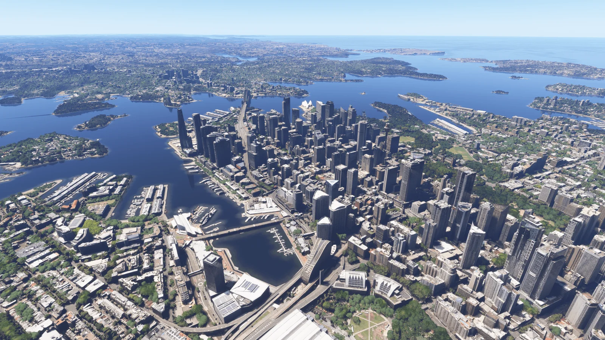

微软与 Asobo Studio 刚刚发布了今年最受期待的区域更新之一。World Update 21 让澳大利亚以全新面貌登陆 Microsoft Flight Simulator 2024 与 2020:40 座经过光摄重制的城市、六座手工建模机场、数十处全新打卡地点,以及一整套新任务,全部免费。

## 等待已久的全面翻新

自 2021 年 1 月发布的 World Update 7 之后,澳大利亚就再没有迎来过大型内容补丁——以模拟器的节奏来看,这已是漫长一段时间。MSFS 团队联手 Bing Maps、Vexcel 与 Gaya,使用最新的光摄数据和全新的 TIN(triangulated irregular network)地表纹理,把整个国家从头刷新。视觉提升立竿见影:悉尼歌剧院、十二门徒岩、内陆的赭红色平原、昆士兰的雨林,终于达到了此前欧洲与北美旗舰更新的同一水准。

更新自 2026 年 5 月 5 日起开放,通过 Content Manager 在 MSFS 2020 与 MSFS 2024 上安装,无需 Premium 版本。覆盖所有平台:PC、Xbox Series X|S 以及 Xbox 云游戏。

## 横跨各州的 40 个兴趣区

40 个 AOI 覆盖六个澳大利亚州与两个联邦领地。新南威尔士州拿走最大份额,共十一座城市:悉尼、纽卡斯尔-梅特兰、蓝山、瓦加瓦加。其后是昆士兰州(布里斯班、黄金海岸、凯恩斯、汤斯维尔、麦凯)十座、维多利亚州(墨尔本、吉朗、本迪戈)八座、西澳大利亚州(珀斯、曼杜拉)五座、南澳大利亚州(阿德莱德)两座、塔斯马尼亚州(霍巴特、朗塞斯顿)两座,加上 ACT 的堪培拉与北领地的达尔文。

*来源:[Microsoft Flight Simulator](https://www.flightsimulator.com/world-update-21/)*

斯普林伍德、查茨伍德、明托、琼达卢普、穆罗尔巴克、伍德克罗夫特等较小郊区也榜上有名。结果很直接:澳大利亚不再是「两座首府加一片模糊腹地」的简单印象,在低空飞行下已能呈现完整国家的脉络。数十处全新 POI(公园、水坝、灯塔、天文台、地标建筑)被手工放置在光摄层之上,为 VFR 飞行员提供清晰的目视参考。

## 六座手工机场——以及豪勋爵岛

主要机场全部由 Gaya 操刀,这家以色列工作室此前曾参与多个 World Update。布点方式鼓励长距离巡航:

- **布罗肯希尔(YBHI)** —— 新南威尔士州内陆,Royal Flying Doctor Service 基地,「银城」门户。
- **布鲁姆(YBRM)** —— 西北部金伯利地区的国际门户。
- **库伯佩迪(YCBP)** —— 南澳著名的蛋白石小镇,红土环境。
- **巴瑟斯特(YBTH)** —— NSW 中部高原,经典的地区通航机场。
- **RAAF 廷德尔基地 / 凯瑟琳(YPTN)** —— 北领地军民两用机场。
- **豪勋爵岛(YLHI)** —— 澳大利亚与新西兰之间的传奇中转点,跑道短,毫不留情。

每座机场都配备定制建筑、精确地面标线、动态滑行道灯与 PBR 材质。仅凭豪勋爵岛就值得下载:火山尖峰之间的短跑道,让每一次进近都像一场小型仪式。

*来源:[Microsoft Flight Simulator](https://www.flightsimulator.com/world-update-21/)*

## 任务、发现飞行与全新丛林之旅

MSFS 2024 玩家拿到完整任务包:三段发现飞行(堪培拉、科科斯群岛、圣灵群岛)、五次精准着陆——其中包括 Mount Wedge 和 South Solitary Island 的直升机停机坪、两次伊尔顿湖与 Kimbolton 的低空挑战,以及三姊妹峰与十二门徒岩两场 Rally 竞速。机型阵容包含波音 737、空客 A320、F/A-18 超级大黄蜂、CubCrafters XCub、罗宾逊 R66 与 Aero Vodochody L-39 Albatros,各种驾驶舱口味都能找到对应。

MSFS 2020 保留三段发现飞行、三次落地挑战(布鲁姆、库伯佩迪、廷德尔),并新增一段沿大洋路的完整**丛林之旅**——这种分段缓行的冒险,正是初代模拟器的灵魂。阿波罗湾、十二门徒岩与坎贝尔港之间是教科书级的 VFR 风景。

## 这对虚拟飞行员意味着什么

除了「免费 DLC,先收下」这条显而易见的理由,本次更新还填补了真实空缺。澳大利亚的虚拟航空、VATPAC 与 IVAO Oceania 成员五年来都在迁就老旧光摄,这个借口已经消失。密集都市(悉尼、墨尔本)与广袤无人之地(库伯佩迪到廷德尔之间可飞一小时不见 500 ft 地标)的反差,使澳大利亚跻身整个模拟器最丰富的训练场之一。

直升机飞行员尤其受益:Mount Wedge、South Solitary Island、悉尼港天际线、圣灵群岛——那些现实中的摄影航线再次回到清单。豪勋爵岛进近则是任何准备短跑道认证者的必修课。

## 如何上手

打开 MSFS 2024(或 2020),进入 **Marketplace → World Updates**,下载 "World Update 21: Australia"。请预留 30 至 60 GB 的硬盘空间,具体取决于已有光摄缓存。安装完成后重启模拟器,从活动菜单选择一段发现飞行,或直接载入六座新机场之一。Bing 实时数据与 Live 天气将以澳洲本地时间呈现——从亚洲看,常常是太平洋上一道动人的拂晓。

官方信息、截图与预告片均在 [Microsoft Flight Simulator World Update 21 页面](https://www.flightsimulator.com/world-update-21/)。任务与丛林之旅攻略将由 [FSElite](https://fselite.net/) 与 [Asobo 官方开发者博客](https://www.flightsimulator.com/category/news/) 在未来几天陆续发布。

## 结语

World Update 21 是 2026 年免费世界更新的范例:实打实的视觉提升、六座具备真实飞行价值的机场、覆盖各类玩家的任务,以及一段向模拟器初心致敬的丛林之旅。等了五年,澳大利亚的虚拟飞行员终于回到世界版图——其他人也得到了一片新大陆可供探索。把自动驾驶设到 YSSY,出发吧。
