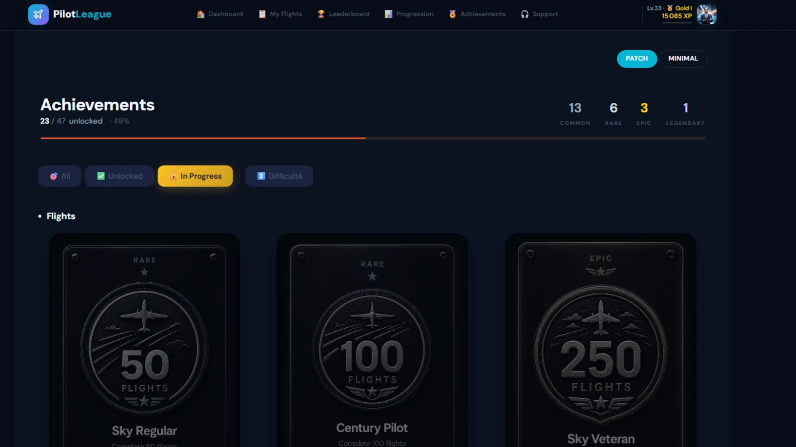

Chaque pilote de simulation tient un score sous une forme ou une autre — qualité d'atterrissage, conso carburant, heures de vol. **[PilotLeague](https://pilotleague.com/fr/)** vient de déployer la version finale de son système de **cartes Achievement**, et la nouvelle direction artistique transforme ces chiffres en véritable collection. 47 cartes, 4 raretés, 50 niveaux et 16 rangs compétitifs sont désormais regroupés dans une grille façon trading card game qui récompense aussi bien un premier décollage qu'un niveau 50.

*Crédit : [PilotLeague Achievements](https://pilots.pilotleague.com/v4/badges)*

## Un vrai système de progression, pas juste un logbook

PilotLeague empile désormais trois couches de progression sur chaque vol connecté :

- **50 niveaux** — XP gagnés via les vols, les atterrissages, la gestion carburant et le respect des SOP.
- **47 achievements** — objectifs uniques ou paliers, chacun avec une illustration et un stat propres.
- **16 rangs compétitifs** — appliqués au leaderboard glissant 14 jours pour garder l'échelle vivante.

Le but du nouveau design est de rendre cette progression **visible**. Au lieu d'une liste numérique, chaque achievement prend la forme d'une carte illustrée, avec un cadre de rareté, un chiffre central (50 vols, 10K XP, centerline < 5 ft) et une barre de progression en dessous. Les cartes sont pensées pour donner envie d'être collectionnées — elles se lisent en un coup d'œil, que ce soit en vol pour vérifier ses objectifs ou en post-flight sur la page badges.

Si vous découvrez la plateforme, notre [guide d'analyse de vol PilotLeague](/fr/blog/pilotleague-analyse-vol-msfs-2024-fr) détaille le moteur de scoring qui alimente chaque gain d'XP affiché sur ces cartes.

## Quatre raretés, quatre langages visuels

L'équipe a conçu quatre traitements visuels distincts — un par rareté — pour que la rareté d'une carte se devine immédiatement à son cadre.

*Crédit : [PilotLeague](https://pilots.pilotleague.com/v4/badges)*

- **Common** — cadre gunmetal sur accents bleu froid. Décrochée pendant les premières dizaines de vols : First Flight (+50 XP), First Landing, First Hour, Profile Complete, Runway Rookie, Butter Landing sous 50 fpm (+100 XP).
- **Rare** — cadre argent-bleu avec stats typographiques nettes. Exemples : **Sky Regular** à 50 vols (+400 XP), Established Pilot au niveau 25, Dedicated Aviator à 50 heures, Perfect Landing.
- **Epic** — accents violet-or sur plaque sombre. On y trouve **Surgeon** (centerline sous 5 ft, +1200 XP), Master Pilot, Long Hauler, Iron Man, Sky Veteran à 250 vols.
- **Legendary** — cadre full-gold avec motifs de laurier. Réservé aux paliers que seuls quelques pilotes atteindront : **Legend** au niveau 50 (+5000 XP), **Perfect Flight** au score 100/100, **Flight Master** à 500 vols.

Chaque carte affiche aussi l'XP qu'elle accorde lors du déblocage, ce qui permet de viser une rareté en particulier. La courbe d'XP est suffisamment marquée pour qu'un déblocage Legendary fasse grimper de plusieurs niveaux d'un coup.

## Une page groupée par catégorie qui tient sur toute la saison

La page Achievements a été repensée autour des cartes. Un en-tête sticky récapitule combien de cartes vous avez débloquées par rareté (les puces affichent les compteurs **Legendary / Epic / Rare / Common**), trois onglets filtrent entre **All**, **In Progress** et **Locked**, et la grille en-dessous est regroupée par catégorie — Flights, Landings, Hours, SOP, Safety, Exploration, Milestones.

*Crédit : [PilotLeague](https://pilots.pilotleague.com/v4/badges)*

Trois détails font tenir la nouvelle page sur une saison entière :

1. **Les barres de progression sous les cartes verrouillées** indiquent exactement où vous en êtes — 38/50 vols, 8 700 / 10 000 XP, 4,2 ft / 5 ft centerline — pour que le déblocage ne soit jamais perçu comme aléatoire.
2. **Les cartes débloquées perdent leur barre** et redeviennent visuellement propres, le cadre de rareté faisant tout le travail.
3. **Le mode clair et le mode sombre** ont été reréglés ensemble : les couleurs de rareté restent lisibles sur les deux thèmes, et la grille conserve la même densité sur mobile comme sur desktop.

L'overlay desktop et la page de profil public reprennent les nouvelles cartes, donc dès qu'une Legendary tombe, elle remonte sur votre URL [pilots.pilotleague.com](https://pilots.pilotleague.com/v4/badges) partageable.

## Cinq cartes qui résument bien le système

| Achievement | Rareté | Condition | XP |
|---|---|---|---|
| First Flight | Common | Terminer un vol tracké | +50 |
| Butter Landing | Common | Atterrissage sous 50 fpm | +100 |
| Sky Regular | Rare | 50 vols | +400 |
| Surgeon | Epic | Centerline sous 5 ft à l'atterrissage | +1200 |
| Legend | Legendary | Atteindre le niveau 50 | +5000 |

Cet étagement est volontaire : la rareté Common existe pour que les nouveaux pilotes voient leur première carte tomber en quelques minutes, les Rare et Epic récompensent un vol régulier semaine après semaine, et la Legendary devient l'objectif de fond de saison. Combiné avec le classement glissant 14 jours documenté dans notre [mise à jour PilotLeague Printemps 2026](/fr/blog/pilotleague-mise-a-jour-printemps-2026-fr), la plateforme dispose maintenant de la même boucle de feedback long terme qui rend Strava, Duolingo ou les achievements Steam accrocheurs. Pour les pilotes qui tiennent un logbook tiers en parallèle, notre [guide du logbook de carrière pilote virtuel](/fr/blog/carriere-pilote-virtuel-logbook) compare cette progression intégrée à des outils comme Volanta ou SimToolkitPro.

## D'autres cartes arrivent en cours de saison

PilotLeague a confirmé que **de nouvelles cartes Achievement seront ajoutées tout au long de la saison**. On peut s'attendre à des drops thématiques — cartes événementielles autour des fly-ins communautaires, cartes Legendary saisonnières qui disparaissent après une fenêtre, et cartes dédiées à l'efficacité carburant, aux SOP et à la safety. Comme les cartes vivent dans le même système de rareté, chaque drop ajoute de la profondeur sans réinitialiser ce que vous avez déjà débloqué.

La roadmap inclut aussi une vue détail de carte (gros plan de l'illustration, date de déblocage, statistiques de rareté à l'échelle de la communauté), et un widget « prochaine carte » sur le dashboard, qui remonte l'achievement le plus proche de votre activité actuelle. À quatre vols par semaine, la prochaine carte Rare n'est jamais bien loin.

## Comment commencer à collectionner

Pour démarrer le déblocage des cartes aujourd'hui, trois étapes suffisent :

1. **Installez l'app desktop PilotLeague** — elle tracke automatiquement les vols dans MSFS 2024 et prend en charge X-Plane 12 en parallèle. Le lien d'installation est sur [pilotleague.com](https://pilotleague.com/fr/fonctionnalites/).
2. **Complétez votre profil** — uploader une photo et un callsign débloque instantanément la carte Common **Profile Complete**.
3. **Volez court** — même un hop de 15 minutes accorde **First Flight** (+50) et, si vous touchez sous 50 fpm, **Butter Landing** (+100).

Ensuite, la [page Achievements](https://pilots.pilotleague.com/v4/badges) devient votre carte au trésor. Filtrez sur **In Progress** : la carte la plus proche à débloquer remonte en haut de la grille.

## Conclusion

Les nouvelles cartes Achievement sont la plus grosse refonte visuelle livrée par PilotLeague depuis l'ouverture des profils publics. Elles transforment chaque vol en un pas concret vers une collection, tiennent la route sur les quatre raretés et laissent une vraie marge pour faire grandir la plateforme tout au long de la saison. Pour les pilotes virtuels qui aiment l'idée de construire quelque chose au fil de leurs sessions MSFS et X-Plane, c'est exactement la boucle de feedback qui manquait au genre — et à coût zéro, c'est un ajout immédiat à votre routine de vol. Surveillez la [page fonctionnalités PilotLeague](https://pilotleague.com/fr/fonctionnalites/) pour le prochain drop de cartes.
