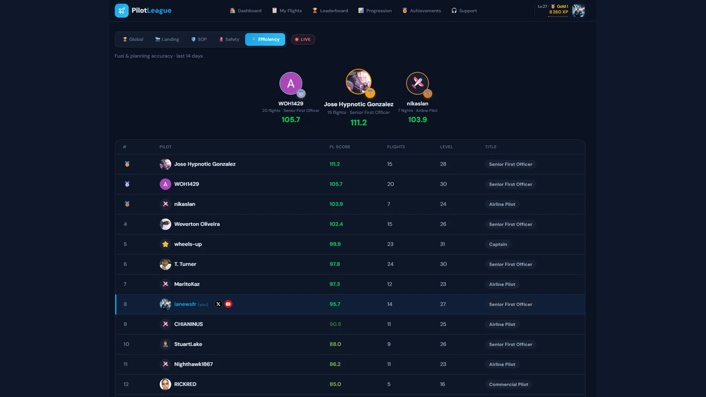

Microsoft Flight Simulator 2024 has one of the most passionate communities in all of sim gaming. Every day, thousands of virtual pilots fly scheduled airline routes, bush-strip STOL landings, and long-haul widebody sectors from their home cockpits. **What the community has been missing is a way to measure real skill over real time — not a lifetime leaderboard that freezes the top slots forever.**

This spring, [PilotLeague](https://pilotleague.com/en/features/) — the Strava for virtual pilots — is shipping its biggest update yet. Over the past 72 hours the team has rebuilt the ranking engine, launched Virtual Airlines support, opened every pilot profile to the public, and fixed several bugs that were silently distorting scores across the community. Here is everything that is new and why it matters.


*Credit: [PilotLeague — Global Leaderboard V2](https://pilotleague.com/en/rankings/)*

## What's New at a Glance

- **Leaderboard V2** — a 14-day rolling window with exponential decay. Active pilots rise; inactive pilots gracefully fall out of the top.
- **Category rankings** — four new specialized leaderboards: Landing, SOP, Safety, and Fuel Efficiency.
- **Virtual Airlines** — pilots can now join or create a VA. Chips, callsigns, and logos appear on leaderboards and public profiles.
- **Public pilot profiles** — every pilot now has a shareable URL: `pilotleague.com/pilots/<username>`.
- **Profile photo uploads** — upload, crop, and show your real photo everywhere on the platform.
- **Safety-first UI** — a new red alert banner on every off-runway landing.
- **GPS track fix** — the flight detail map now shows the true phase-colored trace again.
- **Streak transparency** — clear in-UI explanation that flight streaks boost XP only and never distort ranking.
- **Daily streak sweep** — streaks now correctly expire when you stop flying.

## Leaderboard V2 — The 14-Day Rolling Window That Rewards Real Pilots

The biggest change is philosophical. The old flight simulator leaderboard was cumulative: the pilot with the highest **lifetime** average score sat at the top. Once a pilot with 200 perfect flights from 2024 staked out rank #1, nobody flying in 2026 could catch up without flying hundreds of flawless sectors. New pilots — the lifeblood of any community — were invisible.

**Leaderboard V2 fixes that.** The new `pilotleague_score` is computed as:

```
pilotleague_score = performance_recent × activity_multiplier × reliability_multiplier
```

- **Performance recent** — a 14-day rolling average with exponential decay. Your flight from yesterday counts fully; your flight from two weeks ago counts less; your flight from last quarter contributes almost nothing.
- **Activity multiplier** — bonus for flying consistently in the last 30 days. Not a streak trick, just "are you an active pilot right now?"
- **Reliability multiplier** — recognizes long-term consistency without letting it dominate.

The result is a **fair MSFS 2024 leaderboard** where the top pilots are the ones flying well *this month*, not the ones who flew well two years ago. It refreshes every 15 minutes so ranks stay live. Scores are uncapped above 100 for category boards, so truly exceptional landings or safety performances are visible rather than flattened.

## Category Leaderboards — Specialize and Shine

Beyond the global ranking, PilotLeague now ships four specialized category leaderboards, each powered by its own materialized view:

- **Landing** — based on touchdown V/S, G-force, centerline deviation, and TDZ accuracy. A tailwheel bush pilot with buttery landings can dominate without flying 20,000 ft cruise legs.
- **SOP** — procedural compliance: lights, gear, flaps, stabilized approach, callouts. The virtual airline captain's board.
- **Safety** — no stalls, no overspeeds, no excessive bank, no off-runway landings. Boring and beautiful.
- **Fuel Efficiency** — uses a phase-by-phase fuel model compared to a community baseline to rank pilots who actually plan.

Each tab shows the top 40 pilots in that category, with their V2 score, performance metric, activity badge, flight count, and — new this update — their Virtual Airline chip.

## Virtual Airlines — Join One, Create One, Display It Everywhere

Pilots can now belong to a **Virtual Airline (VA)**. A VA has a slug, a name, a callsign, an IATA code, and an optional logo. Once you join, the VA chip appears next to your name on every leaderboard, in your public pilot profile header, and in the World Rank banner on your profile.

Creating a VA is frictionless. Start typing the name in **Settings → Networks**; if it does not exist yet, hit *"Create '<name>'"*. Your new VA is created immediately and you become its first member. Verified status (the blue checkmark) is granted manually by the PilotLeague team once the VA proves organic activity — this protects the community from squatters.

This is the first step toward full **virtual airline management for MSFS 2024**: scheduled routes, fleet rosters, rank progression, and dedicated VA leaderboards are on the roadmap.

## Public Pilot Profiles — Share Your Flight Journey

Every pilot now has a canonical URL you can share on Discord, X, a forum, or your flight sim blog:

```
https://pilotleague.com/pilots/<username>
```


*Credit: [PilotLeague — Public Pilot Profile](https://pilotleague.com/en/)*

The public profile shows:

- **Identity header** — avatar, display name, country flag, callsign, VA chip, IVAO/VATSIM IDs, social handles (X, Bluesky, Twitch, YouTube)
- **World Rank banner** — your current V2 rank and score
- **Level + XP bar** — how close you are to the next rank
- **Key stats** — total flights, hours, distance, average score
- **Performance chart** — 30-day score trend
- **Recent flights list** — the 10 latest flights with route, score, and date

Visibility is per-pilot: you can keep your flights private if you want, while still showing your identity and rank.

## Avatar Uploads — Your Face, Your Cockpit

Until now, pilots could pick from a small set of emoji avatars or a Google OAuth photo. This update ships full photo upload with interactive cropping:

1. Go to **Settings → Account**
2. Click your current avatar
3. Upload a JPG/PNG (client-side resize to 512×512 max)
4. Use the circular crop tool to frame your face
5. Save

Your uploaded photo replaces the default everywhere — navbar, leaderboard rows, public profile, and comment threads. File size is enforced server-side (2 MB cap) and an NSFW content check runs on upload.

## Safety-First UI — The Red Off-Runway Banner

If your wheels touch down outside the runway edges, the PilotLeague capture app detects it within 500 ms of touchdown using a 5-frame grace window — enough to absorb SimConnect lag on the `ON ANY RUNWAY` simvar without false positives. The event is emitted, stored, and penalized **−100 safety points** in a single atomic cumulative hit.


*Credit: [PilotLeague — Off-Runway Safety Alert](https://pilotleague.com/en/)*

**What's new:** the flight detail page now shows a large red gradient banner at the top — **OFF-RUNWAY LANDING** — with a plain-language explanation and the −100 chip. Previously the event was buried in the event timeline and pilots saw `safety_score = 0` without context.

Available in all 7 supported UI languages: English, French, German, Spanish, Brazilian Portuguese, Japanese, and Simplified Chinese.

## GPS Track Fix — See Your Real Flight Again

For about two weeks, some pilots saw a yellow dashed straight line between departure and arrival on the flight detail map, even though their actual track with colored flight phases should have been rendered. The cause was a backend bug: the visibility check was querying `profile_visibility` from the wrong table, returning HTTP 500 on the GPS track endpoint. The map fell back silently to a straight-line fallback.


*Credit: [PilotLeague — Phase-Colored GPS Track](https://pilotleague.com/en/)*

**This is now fixed.** On every flight you will see the full phase-colored polyline: takeoff, initial climb, climb, cruise, descent, approach, landing, taxi. The map uses adaptive sampling to keep rendering fast even on 10-hour Pacific widebody flights with more than 1,500 telemetry points.

## Streak Transparency — Two Hidden Bugs, Fixed

Flight streaks — the counter showing how many consecutive days you have flown — had two silent problems that distorted what pilots saw.

**Bug 1:** The streak never actually expired. The SQL function to reset stale streaks existed but was never scheduled. A pilot who flew 10 days straight and then took a month off still saw `current_streak = 10` forever.

**Bug 2:** Opening the flight detail of an old flight secretly rewrote the pilot's `last_flight_date` to today — making the streak system think that pilot had flown today. Combined with Bug 1, streaks were fossilized at whatever number they last hit.

Both are fixed. A nightly sweep at 00:05 CET now correctly zeroes `current_streak` for any pilot who has not flown in more than one day. Your longest streak is still preserved as a personal record.

**Plus a UX clarification:** the streak card now explicitly states *"Bonus XP only — does not affect scores or ranking"* and shows the full 6-tier ladder (1–2d ×1.00 / 3d+ ×1.05 / 7d+ ×1.10 / 14d+ ×1.15 / 30d+ ×1.20 / 60d+ ×1.25) with your active tier highlighted. Streaks accelerate your leveling-up, period. They never inflate your pilot rank.

## Site-Wide Consistency — Public and Private Finally Match

The public site at `pilotleague.com/rankings/*` and the authenticated front office at `pilots.pilotleague.com/v4/leaderboard` were previously driven by two different SQL layers. You could see different top pilots in different places. That is gone — both sites now read the same V2 materialized views, so every visitor, logged-in or not, sees the same ranking at the same refresh cadence.

## Language Support

The PilotLeague front office ships native translations for 7 languages: English, French, German, Spanish, Brazilian Portuguese, Japanese, and Simplified Chinese. Every new feature in this update — off-runway banner, streak card, XP detail, Virtual Airline UI — is fully localized out of the box.

## Frequently Asked Questions

**What is PilotLeague?**
PilotLeague is a free companion app and web platform for Microsoft Flight Simulator 2024. It tracks your flights, scores your landings and procedures, and ranks you against the global community — like Strava, but for virtual pilots.

**How is the new leaderboard score calculated?**
`pilotleague_score = performance_recent × activity_multiplier × reliability_multiplier`. Performance uses a 14-day rolling window with exponential decay, so recent flights matter more than old ones.

**Does streak affect my ranking?**
No. Streaks only boost XP (leveling up), never your score or ranking. The six tiers top out at ×1.25 at 60+ consecutive days.

**What is a Virtual Airline on PilotLeague?**
A Virtual Airline (VA) is a group of pilots flying under a shared callsign, IATA code, and logo. Pilots can join an existing VA or create a new one from Settings → Networks. VA metadata shows up next to your name on every leaderboard.

**Is PilotLeague free?**
Yes. The companion app and the web platform are free for all MSFS 2024 pilots.

**Which platforms are supported?**
Windows desktop (MSFS 2024 companion capture app) and web (`pilots.pilotleague.com`). Mobile web is fully responsive.

## Try It Now

Ready to see where you rank?

- **Live global leaderboard** — [pilotleague.com/en/rankings](https://pilotleague.com/en/rankings/)
- **Landing ranking** — [pilotleague.com/en/rankings/landing](https://pilotleague.com/en/rankings/landing/)
- **Fuel efficiency ranking** — [pilotleague.com/en/rankings/fuel](https://pilotleague.com/en/rankings/fuel/)
- **Safety ranking** — [pilotleague.com/en/rankings/safety](https://pilotleague.com/en/rankings/safety/)
- **Download the companion app** — [pilotleague.com/en/download](https://pilotleague.com/en/download/)

New pilots flying their first tracked flight appear in the leaderboard within minutes of finalization. The top spots are up for grabs every 14 days.

**See you in the pattern.**

<script type="application/ld+json">
{
  "@context": "https://schema.org",
  "@type": "FAQPage",
  "mainEntity": [
    { "@type": "Question", "name": "What is PilotLeague?", "acceptedAnswer": { "@type": "Answer", "text": "PilotLeague is a free companion app and web platform for Microsoft Flight Simulator 2024. It tracks your flights, scores your landings and procedures, and ranks you against the global community — like Strava, but for virtual pilots." } },
    { "@type": "Question", "name": "How is the new leaderboard score calculated?", "acceptedAnswer": { "@type": "Answer", "text": "pilotleague_score = performance_recent × activity_multiplier × reliability_multiplier. Performance uses a 14-day rolling window with exponential decay, so recent flights matter more than old ones." } },
    { "@type": "Question", "name": "Does streak affect my ranking?", "acceptedAnswer": { "@type": "Answer", "text": "No. Streaks only boost XP (leveling up), never your score or ranking. The six tiers top out at ×1.25 at 60+ consecutive days." } },
    { "@type": "Question", "name": "What is a Virtual Airline on PilotLeague?", "acceptedAnswer": { "@type": "Answer", "text": "A Virtual Airline (VA) is a group of pilots flying under a shared callsign, IATA code, and logo. Pilots can join an existing VA or create a new one from Settings → Networks. VA metadata shows up next to your name on every leaderboard." } },
    { "@type": "Question", "name": "Is PilotLeague free?", "acceptedAnswer": { "@type": "Answer", "text": "Yes. The companion app and the web platform are free for all MSFS 2024 pilots." } }
  ]
}
</script>
