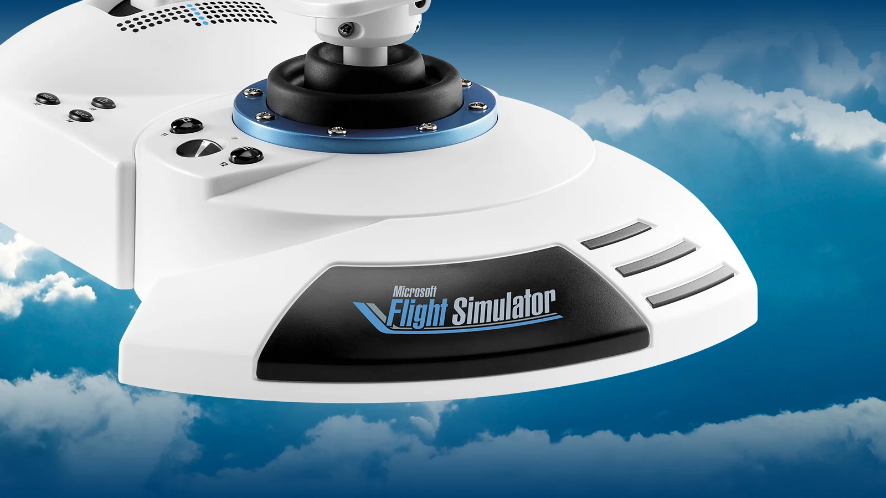

Si un seul matériel revient en boucle dans les recommandations aux pilotes virtuels débutants, c'est bien le **[Thrustmaster T.Flight HOTAS One Microsoft Flight Simulator Edition](https://www.thrustmaster.com/fr-fr/products/t-flight-hotas-one-microsoft-flight-simulator-edition/)**. Officiellement licencié par Microsoft, vendu autour de 110 €, compatible PC et Xbox Series X|S, ce HOTAS s'est imposé comme le premier ensemble manche-throttle de référence pour qui veut un vrai combo sans passer chez Honeycomb ou Virpil. Voici ce que l'édition MSFS change vraiment — et pourquoi elle reste pertinente en 2026.

*Crédit : [Thrustmaster](https://www.thrustmaster.com/fr-fr/products/t-flight-hotas-one-microsoft-flight-simulator-edition/)*

## Ce que contient la boîte

L'édition MSFS embarque exactement le même hardware que le T.Flight HOTAS One classique, avec une **livrée officielle Microsoft Flight Simulator** — couleurs et logo MSFS sur le throttle, packaging revu pour le simulateur — plus un **mois d'abonnement Xbox Game Pass** offert. Dans la boîte : le HOTAS, une clé Allen (pour basculer le verrouillage du palonnier), la garantie et le manuel. Poids autour de 2 kg ; encombrement assemblé d'environ **350 × 200 × 235 mm**.

Le matériel est bâti autour d'un **layout HOTAS complet** : main sur la manette des gaz, main sur le manche. Le throttle est **entièrement détachable** — pratique pour le poser à gauche de la chaise, sur l'accoudoir ou à hauteur de bureau. Une base lestée garde l'ensemble stable sur un bureau, et le poids reste suffisamment contenu pour voler sur les genoux dans le canapé, ce qui parle plus aux joueurs Xbox que le marketing ne l'admet en général.

## La planche de bord, en détail

L'ensemble de commandes a été pensé pour l'initiation, mais couvre plus de besoins que ne le suggère le tarif :

- **5 axes** — tangage, roulis, gaz, plus un **double système de palonnier** (axe Z par torsion du manche, ou levier basculant à la base au choix)
- **14 boutons** répartis sur manche et throttle
- **1 gâchette rapide** sous l'index
- **1 chapeau directionnel multi-positions** pour le regard ou le trim
- **Précision 10 bits** sur les axes principaux — assez de résolution pour ne pas voir un effet d'escalier sur la profondeur en croisière
- **Résistance ajustable** sur le manche — vous serrez ou desserrez le ressort central selon que vous volez en ligne (souple) ou en chasse (ferme)

*Crédit : [Thrustmaster](https://www.thrustmaster.com/fr-fr/products/t-flight-hotas-one-microsoft-flight-simulator-edition/)*

Le double système de palonnier est le choix de design qui définit ce produit. **Vous tordez le manche** si vous n'avez pas de pédales ; **vous basculez le levier progressif à la base** si la torsion contamine votre roulis. Les utilisateurs avancés finissent par ajouter des vraies pédales (le HOTAS One est explicitement compatible avec les **Thrustmaster TFRP**, vendues séparément), mais le palonnier intégré reste une nette amélioration par rapport au pilotage clavier.

Le throttle est à potentiomètre, course lisse et régulière. Pas de cran de reverse ni de cliquet de postcombustion, ce qui est cohérent avec un produit estampillé MSFS, orienté aviation générale et lignes plus que chasseurs rapides.

## Ce que ça change pour les pilotes virtuels

Pour un pilote qui sort du combo clavier-souris, le HOTAS One c'est la différence entre **voler à deux pouces** et **voler à deux mains**. La manette des gaz dédiée transforme déjà la gestion d'approche — au lieu de tapoter F2/F3 vous lissez la poussée précisément ; au lieu d'activer les spoilers en raccourci vous les assignez à un bouton du manche que vous trouvez sans regarder. En quelques heures, vous arrêtez de penser aux commandes pour piloter l'avion.

Le manche est suffisamment bon pour que le T.Flight HOTAS One apparaisse régulièrement dans notre [comparatif des meilleurs HOTAS 2026](/fr/blog/meilleurs-hotas-controleurs-vol-2026) comme la meilleure option entrée de gamme, surtout combiné avec un yoke d'appoint pour les lignes. Si vous montez encore votre première station, notre [guide débutant simulation de vol](/fr/blog/guide-debutant-simulation-vol) explique comment le HOTAS s'intègre dans le reste de l'installation (PC, écran, pédales à venir).

*Crédit : [Thrustmaster](https://www.thrustmaster.com/fr-fr/products/t-flight-hotas-one-microsoft-flight-simulator-edition/)*

## Où se situe l'édition MSFS en 2026

Le marché du matériel a évolué depuis le HOTAS One original, avec les combos Honeycomb Alpha/Bravo haut de gamme et les manches Virpil/VKB premium. Le HOTAS One ne prétend pas se mesurer à ces produits. **Ce qu'il garde, c'est le segment sous 120 €** — et c'est précisément là que la plupart des nouveaux simmers achètent.

Face à des alternatives milieu de gamme comme le Logitech X52, le Thrustmaster propose moins de boutons mais un meilleur ressenti du manche et un throttle plus propre. Face aux solutions purement manche comme le Logitech 3D Pro, le HOTAS One gagne sur la simple présence d'une vraie manette des gaz. Notre [test matériel joystick et yoke pour la simulation](/fr/blog/test-materiel-joystick-yoke-simulation) compare ces options côte à côte ; le HOTAS One reste la recommandation sûre pour qui veut un seul achat qui couvre MSFS 2024, X-Plane et DCS World en jeu détendu.

## Conseils de configuration MSFS 2024

Quelques notes pratiques après pas mal d'heures sur MSFS, X-Plane et DCS avec ce manche :

- **MSFS 2024 détecte automatiquement le HOTAS One** avec un profil pré-configuré. La plupart des pilotes ne retouchent que l'inversion du throttle et l'assignation du chapeau de vue.
- **Sur Xbox**, branchez sur le port USB ; aucun driver à installer. Sur PC, passez par le dernier utilitaire Thrustmaster — il active la précision 10 bits et les dernières mises à jour de détentes.
- **Réassignez la gâchette** sur les freins ou le frein de parking avant de voler en GA — le mapping par défaut varie selon le sim et c'est l'erreur n°1 des débutants.
- **Si la torsion contamine votre roulis**, basculez sur le **levier de palonnier progressif** à la base via la clé Allen fournie. Cela verrouille un mode et libère l'autre.

*Crédit : [Thrustmaster](https://www.thrustmaster.com/fr-fr/products/t-flight-hotas-one-microsoft-flight-simulator-edition/)*

## Conclusion

Le Thrustmaster T.Flight HOTAS One Microsoft Flight Simulator Edition n'est pas le HOTAS le plus précis du marché, et il n'essaie pas de l'être. C'est **le meilleur achat à 110 € pour un premier ensemble manche-throttle** dédié à MSFS 2024 — un HOTAS complet sous licence officielle, prêt pour PC comme Xbox, livré avec un mois de Game Pass, et qui sort définitivement le clavier de la croisière, de l'approche et de l'atterrissage. Pour qui sort de la souris-clavier, c'est encore la recommandation qui rend le plus de pilotes virtuels heureux. La [page produit Thrustmaster](https://www.thrustmaster.com/fr-fr/products/t-flight-hotas-one-microsoft-flight-simulator-edition/) reste la source la plus propre pour vérifier le prix et les bundles du moment.
